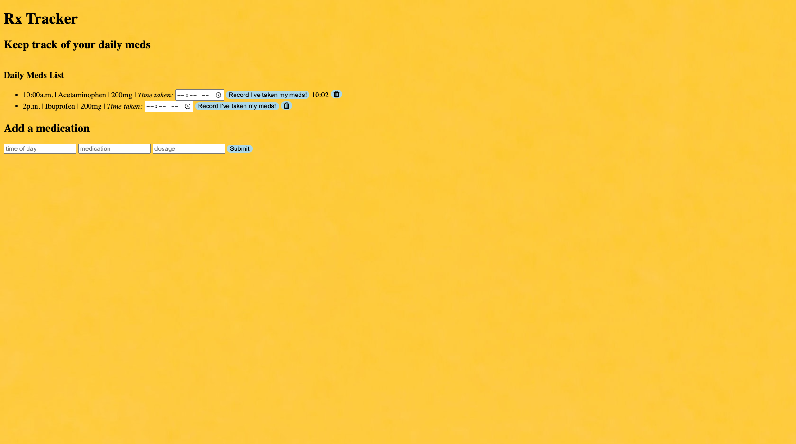

# rxTracker

Keep track of the time you are prescribed to take your medication and when you take them. 

## Technologies Used:

JavaScript, EJS, Node.js, CSS, HTML

## Installation
1. Clone repo
2. run npm install

## Usage
1. run node server.js
2. Navigate to localhost:3055

## Credit
Modified from Scotch.io's auth tutorial
